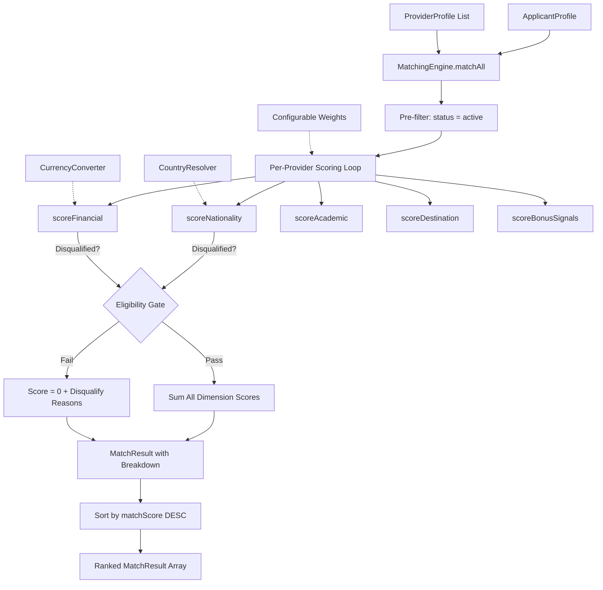

# Intelligent Matching Engine

Multi-criteria weighted scoring system for ranking providers against applicant profiles. Combines hard eligibility gates with soft scoring dimensions, pluggable country resolution, currency conversion, and full score breakdown transparency.

## 1. Problem Statement

Marketplace platforms that connect applicants with providers (lenders, institutions, service partners) need to answer: "Given this applicant's profile, which providers are eligible, and in what order should they be ranked?"

Simple filtering (eligible: yes/no) discards useful ranking information. An applicant may be eligible for 15 providers — but 3 of them are meaningfully better fits based on financial terms, geographic alignment, and processing speed. This engine produces ranked, scored matches with per-dimension breakdowns and explicit disqualification reasons, enabling both automated routing and human-in-the-loop review.

## 2. Why This Matters

- Binary filtering loses information. A provider that matches on 4 of 5 criteria is not equivalent to one that matches on 2 of 5. Weighted scoring preserves this ranking signal.
- Eligibility rules span multiple domains (nationality, financials, academics, geography) with different data formats and validation logic. Centralizing this in a single engine prevents scattered eligibility checks across the codebase.
- Match transparency is required for compliance. When an applicant asks "why was I matched with this provider?", the system must produce a traceable breakdown — not a black-box score.
- Provider criteria change frequently. The engine accepts `ProviderProfile` objects with `EligibilityCriteria` at runtime, not hardcoded rules.

## 3. System Overview

The `MatchingEngine` evaluates an `ApplicantProfile` against a list of `ProviderProfile` objects across 5 scoring dimensions:

1. **Nationality** (default weight: 20) — Hard gate. Checks if applicant's nationality is in the provider's eligible country list. Uses an optional pluggable `CountryResolver` for code/name normalization.
2. **Financial** (default weight: 25) — Hard gate. Validates requested amount against provider's min/max range. Uses an optional pluggable `CurrencyConverter` for cross-currency comparison.
3. **Academic** (default weight: 20) — Soft score. Checks minimum percentage and accepted qualifications.
4. **Destination** (default weight: 20) — Soft score. Checks if applicant's destination country is in provider's eligible destinations.
5. **Bonus signals** (default weight: 15) — Soft score. Rewards providers with fast processing, high coverage, and low interest rates.

Nationality and financial failures result in **disqualification** (total score = 0). Other dimensions contribute to ranking without disqualification. The engine pre-filters inactive providers before scoring.

## 4. Architecture Diagram (Mermaid)



## 5. Core Design Decisions

**Why weighted scoring instead of boolean filtering.**
Boolean filters discard ranking information. An applicant eligible for 15 providers needs a ranking — not just a list. Weighted scoring produces a total score (0-100) with per-dimension breakdowns, enabling both automated top-N selection and human review of borderline cases.

**Why hard gates on nationality and financial, but not academic or destination.**
Nationality and financial eligibility are non-negotiable compliance requirements — a provider cannot serve a nationality it does not cover, or an amount outside its range. Academic and destination mismatches reduce fit but do not create legal/operational impossibility. The distinction between hard gates (disqualification) and soft scores (reduced ranking) reflects this real-world asymmetry.

**Why pluggable `CountryResolver` and `CurrencyConverter`.**
Applicant profiles may contain country names ("India"), ISO codes ("IN"), or phone-number-derived codes ("+91"). Provider eligibility lists may use a different format. Rather than building a universal country database into the engine, the resolver is injected — keeping the matching logic pure and the normalization concern externalized. Same logic applies to currency conversion.

**Why configurable weights with sensible defaults.**
Different deployment contexts weight criteria differently. A platform focused on financial products may weight the financial dimension at 35 instead of 25. The `DEFAULT_WEIGHTS` object provides a starting point; the constructor accepts `Partial<ScoringWeights>` for overrides.

**Why match reasons and disqualify reasons are separate arrays.**
A single `reasons` array conflates positive and negative signals. Separating them enables UIs to show "Why this match" (green) and "Why not this match" (red) independently, and enables programmatic filtering ("show me all disqualifications due to nationality").

## 6. AI / Model Strategy

The core matching algorithm is deterministic — no LLM calls, no model inference. This is intentional: matching decisions must be reproducible, auditable, and fast (sub-millisecond per provider).

The architecture supports AI enhancement at two integration points:

- **Weight optimization.** Historical match outcomes (which provider was ultimately selected, conversion rates) can train an ML model to optimize weight distributions. The `ScoringWeights` interface is designed for this — swap in learned weights without changing scoring logic.
- **Fuzzy matching via CountryResolver.** The pluggable resolver can be backed by an NLP model for fuzzy country name matching ("UAE" → "United Arab Emirates", "UK" → "United Kingdom"). This is a contained integration point — the model resolves a string, the engine evaluates a boolean.

No embeddings or retrieval is used. The provider list is expected to be small enough (hundreds, not millions) that linear scoring is sufficient.

## 7. Scalability Considerations

- **O(n) per applicant.** Each provider is scored independently. For 500 providers, matching completes in < 1ms. No external calls required for core scoring.
- **Stateless engine.** The `MatchingEngine` instance holds only configuration (weights, resolver, converter). It has no per-request state. Multiple requests can share the same instance safely.
- **Parallelizable across applicants.** Batch matching can be parallelized with `Promise.all` or worker threads. Each applicant's matching is independent.
- **Provider list is runtime input.** The engine does not manage provider storage. It receives a `ProviderProfile[]` per call. This means provider updates (new providers, changed criteria) take effect immediately without engine reinitialization.

## 8. Security Considerations

- **No data persistence.** The engine does not store applicant profiles, provider profiles, or match results. It computes and returns.
- **No external calls in core scoring.** The `CountryResolver` and `CurrencyConverter` are optional and injected. Without them, the engine operates entirely in-memory with no network access.
- **Score transparency prevents gaming.** The `ScoreBreakdown` and `matchReasons`/`disqualifyReasons` arrays provide full auditability. Any score can be traced to the specific dimension and criteria that produced it.
- **Input validation.** The engine handles missing fields gracefully — `undefined` nationality scores at 25% of max (not disqualified), `undefined` amount scores at 25% of max. This prevents null pointer exceptions while producing conservative scores for incomplete profiles.

## 9. Performance Optimizations

- **Pre-filter inactive providers.** `matchAll` filters `status === 'active'` before entering the scoring loop. Inactive providers are never scored.
- **Early disqualification.** While the current implementation scores all dimensions before aggregating, the hard-gate pattern enables short-circuiting: if nationality disqualifies, remaining dimensions could be skipped. This optimization is straightforward to add if the provider list grows large.
- **No object allocation in hot path.** Score results are plain objects, not class instances. The scoring loop avoids closures and dynamic dispatch.
- **Currency conversion is called at most once per provider.** The financial scorer converts the amount once and compares against min/max — not per-criterion.

## 10. Example Flow

**Input:** Applicant from India requesting 2,000,000 INR for study in the US, 78% academic score.

1. `matchAll(providers, applicant)` called with 50 active providers
2. Pre-filter: 45 providers have `status: 'active'`
3. For Provider X (eligible countries: ["IN", "PK", "BD"], max amount: $30,000, eligible destinations: ["US", "UK"]):
   - Nationality: "IN" in ["IN", "PK", "BD"] → score: 20/20
   - Financial: 2,000,000 INR → `currencyConverter(2000000, "INR", "USD")` → $24,000 → within range → score: 25/25
   - Academic: 78% >= 60% minimum → score: 14/20
   - Destination: "US" in ["US", "UK"] → score: 20/20
   - Bonus: processingTimeDays: 5 (<=7, +4.5), maxCoverage: 95% (>=90, +4.5), interestRate: 7% (<8, +6) → score: 15/15
4. Total: 94/100, eligible, 4 match reasons
5. All 45 providers scored → sorted by `matchScore` descending → returned

## 11. Sample API Contract

**Request:**
```typescript
const engine = new MatchingEngine({
  weights: { nationality: 20, financial: 25, academic: 20, destination: 20, bonus: 15 },
  countryResolver: resolveCountry,
  currencyConverter: convertCurrency
});

const results = engine.matchAll(providers, applicant);
```

**Response (single result):**
```json
{
  "provider": { "id": "lender-42", "name": "Provider X", "status": "active" },
  "matchScore": 94,
  "isEligible": true,
  "matchReasons": [
    "Nationality eligible (IN)",
    "Financial criteria met",
    "Academic criteria met",
    "Destination US supported",
    "Additional compatibility signals matched"
  ],
  "disqualifyReasons": [],
  "breakdown": {
    "nationalityScore": 20,
    "financialScore": 25,
    "academicScore": 14,
    "destinationScore": 20,
    "bonusScore": 15
  }
}
```

## 12. Folder Structure Explanation

```
src/
  core/
    MatchingEngine.ts    — Scoring engine, eligibility gates, type definitions for profiles and results
  index.ts               — Public API surface and type exports
```

The engine is a single file because all scoring dimensions share the same weight system, the same provider/applicant interfaces, and the same result structure. Splitting scorers into separate files would require passing configuration (weights, resolver, converter) to each — adding indirection without reducing complexity. If the number of scoring dimensions grows beyond 7-8, a strategy pattern with per-dimension scorer classes would be appropriate.

## 13. Future Improvements

- ML-optimized weight tuning: train on historical match-to-conversion data to find optimal weight distributions per market segment
- Fuzzy qualification matching: use embedding similarity for qualification names ("B.Tech" ≈ "Bachelor of Technology")
- Real-time provider availability: integrate provider capacity signals (current processing backlog, available quota) as a scoring dimension
- A/B testing framework: run multiple weight configurations simultaneously and measure conversion impact
- Batch matching API with streaming results for processing applicant queues
- Explanation generation: produce human-readable summaries of why a specific provider was ranked first
